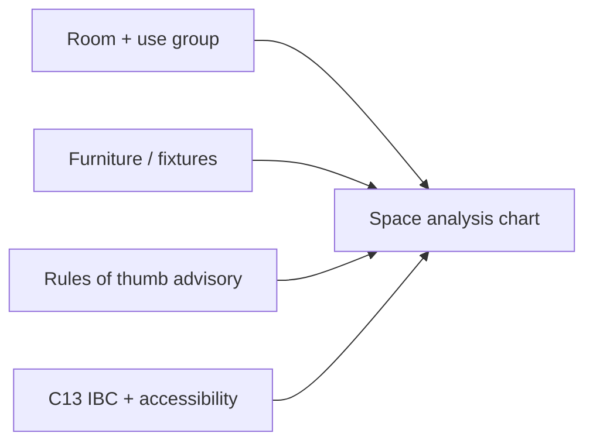

# Erganis Studio — Implementation Plan

> **Status:** **Ref** (hello-world) done; **S0+** not started.  
> **Product plan:** [§7 Studio](../../../docs/erganis-product-plan.md#7-studio) · **Core deps:** [CORE-IMPLEMENTATION-PLAN](../../core/docs/temp/CORE-IMPLEMENTATION-PLAN.md) · **Index:** [IMPLEMENTATION-PLANS](../../../docs/IMPLEMENTATION-PLANS.md)

Studio ships as **per-module slices** — schema + handlers first (Nest modules loaded by Core), then Surface UI in `studio/apps/studio`. Complete Core **C3–C7** before the first real module ships end-to-end in the UI.

---

## Overview

| Phase | Module | Slice | Status | Core deps |
|-------|--------|-------|--------|-----------|
| **Ref** | Hello-world | — | Done | C2 |
| **S0** | Studio shell | 0 | Planned | C1 |
| **S-D1** | Documents | 1 | Planned | C2, C6 |
| **S-D2** | Documents | 2 | Planned | C7, S0 |
| **S-D3** | Documents | 3 | Planned | S0 client, RBAC |
| **S-I1** | Inventory | 1 | Planned | C2 |
| **S-I2** | Inventory | 2 | Planned | C3 |
| **S-I3** | Inventory | 3 | Planned | Presentations S-Pr1 |
| **S-P1** | Planner | 1 | Planned | C2, C7 |
| **S-P2** | Planner | 2 | Planned | S-C1 |
| **S-C1** | Communications | 1 | Planned | C1, C9 |
| **S-Des1** | Design | 1 | Planned | C2, C7 |
| **S-Pr1** | Presentations | 1 | Planned | S-I1, S-Des1 |
| **S-B1** | Build | 1 | Planned | S-D1, C3 |
| **S-B2** | Build — Codes | 2 | Planned | C13, S-B1 |
| **S-B3** | Build — Space analysis | 3 | Planned | S-B2, S-I1 optional |
| **S-Bus1** | Business | 1 | Planned | Reports S-R1 (later) |
| **S-R1** | Reports | 1 | Planned | Multiple modules |
| **S-N1** | Notes | 1 | Planned | C2 |
| **S-Ago1** | Agora (org) | 1 | Planned | Agora API, C2 |
| **S-3P** | Third-party | — | Planned | C4 |

---

## Ref — Hello-world stub

**Path:** `studio/modules/hello-world/`  
**Delivers:** Stub handler + envelope smoke proving Core loader path.

- Manifest: `erganis.module.json`
- Surface/action: `stub.save`
- Handler: `pingSave` → `hello_world.greetings`
- Build before Core: `npm install && npm run build`

---

## S0 — Studio web shell

**Path:** `studio/apps/studio/`, `studio/shared/`  
**Delivers:** Next.js shell, shadcn tokens, generated API client, login flow to Core auth.

| Item | Detail |
|------|--------|
| UI stack | Next.js + React + TypeScript + shadcn/ui + Tailwind |
| Shared layer | `studio/shared/` — components, tokens, API clients |
| Auth | Session cookie flow to Core C1 |
| Composition | Consume `GET /composition/slots` (C10) |

**Blocks:** All Surface UI slices (S-D2+, module dashboards).

---

## S-D1 — Documents (backend)

**Path:** `studio/modules/documents/`  
**Delivers:** `documents.*` schema + `migrations/`; upload metadata; vault list API; envelope `save` handler.

**Core deps:** C2 orchestrator, **C6 FileStore** for bytes.

---

## S-D2 — Documents (Surface UI)

**Delivers:** Project-linked attachments; Surface `documents` load; vault UI slot.

**Deps:** C7 Surface API, S0 shell.

---

## S-D3 — Documents (client portal)

**Delivers:** Client portal read-only vault view; trade-doc templates.

**Deps:** S0 client app (`apps/client`), RBAC.

---

## S-I1 — Inventory (CRUD)

**Delivers:** Product/material CRUD; `inventory.*` schema; envelope `save` (`phase: db`, `failureClass: required`).

---

## S-I2 — Inventory (alternatives)

**Delivers:** Product alternatives; multi-step save with optional `post_commit`; `outcome: partial`.

**Core dep:** **C3** orchestrator hardening.

---

## S-I3 — Inventory (integrations)

**Delivers:** Shipment tracking hooks; Presentations composition blocks.

---

## S-P1 — Planner (Tasks / Kanban)

**Delivers:** Tasks (daily todo); Kanban board; envelope save.

---

## S-P2 — Planner (calendar)

**Delivers:** Calendar / scheduling; iCal consume from Communications.

---

## S-C1 — Communications

**Delivers:** Mailbox OAuth (separate from org SSO); thread list.

**Core deps:** C1 auth patterns, **C9** pg-boss jobs for sync.

---

## S-Des1 — Design v1

**Delivers:** Spaces, palettes, mood boards.

---

## S-Pr1 — Presentations

**Delivers:** Proposal builder; Inventory/Design composition blocks.

---

## S-B1 — Build (drawings & approvals)

**Path:** `studio/modules/build/`  
**Delivers:** Drawing vault refs; tags on drawing sets; approval envelope.

**Deps:** Documents S-D1, C3 entity locks.

- Drawing sets stored via Core FileStore (C6)
- Tags on plans/elevations — standalone or linked to Inventory `productPublicId`
- Drawing approval workflow — Core users & roles, orchestrator envelope

---

## S-B2 — Build — Codes (IBC & accessibility)

**Delivers:** Designer-facing **Codes** component — layered on Core **C13 Codes provider adapter**.

### Why layered

IBC and accessibility standards change by edition and jurisdiction. Build must not ship static code tables. Instead:

1. **Core C13** syncs and versions rule packs (external code service or publisher API via C9 jobs)
2. **Build module** queries applicable rules for the project's jurisdiction, occupancy group, and use type
3. **Build UI** surfaces code requirements as actionable guidance — not legal PDFs in a drawer

### Planned capabilities

| Area | Examples |
|------|----------|
| **IBC** | Occupancy classification, occupant load factors, egress width mins, plumbing fixture counts by occupancy |
| **Accessibility** | Clearances, reach ranges, turning space, door maneuvering — parallel rule family in same adapter |
| **Project context** | Building type, story count, sprinklered — filters which rule subsets apply |
| **Edition tracking** | Show active IBC edition; warn when project edition differs from latest synced pack |

### Surfaces

- `build.codes` load — applicable rule summary for current room/project
- Envelope save for designer overrides / notes (not altering Core rule packs)

**Core deps:** **C13** Codes provider, C9 sync jobs.

---

## S-B3 — Build — Space analysis & occupancy planner

**Delivers:** **Chart / analysis system** for rooms — help interior and architectural designers size spaces from program, furniture, circulation, and code — connecting IBC to everyday layout decisions.

### Analysis dimensions

| Dimension | Purpose |
|-----------|---------|
| **Room inventory** | What is in the room — furniture, fixtures, equipment (manual entry, Inventory link, or FF&E import) |
| **Footprint & clearance** | Per-item dimensions + required clearances; stack vs plan view summaries |
| **Occupant load** | User group / use type → occupant count via C13 IBC factors |
| **Circulation** | Aisle width, door swing zones, path of travel — designer standards + code mins |
| **Rules of thumb** | General designer standards (conference seats per area, kitchen work triangle hints, etc.) — **advisory** layer separate from binding code |
| **Code cross-check** | Compare calculated area / egress / fixtures against S-B2 Codes rules — pass / warn / fail |

### Chart system (concept)

Interactive room **analysis chart** — not just a static spreadsheet:

- **Program bar** — required area from occupancy × load factor
- **Furniture layer** — summed item footprints + clearances
- **Circulation layer** — remaining area vs recommended % of room
- **Code overlay** — IBC minimums from C13 (egress, accessibility clearance) highlighted on the chart
- **Scenario compare** — layout A vs B occupancy and clearance outcomes



### Designer outcomes

- Answer: *"Can this room hold 12 people with this furniture layout and meet egress?"*
- Bridge architectural IBC concepts (occupancy group, load factor) to interior layout (seating, clear paths)
- Export summary to Presentations or drawing set notes (later slice)

**Deps:** **S-B2** Codes, optional **S-I1** Inventory for product dimensions, **C13** for live rule values.

**Failure classes:** Code violations → `required` warnings in analysis; rules-of-thumb → `advisory` only.

---

## S-Bus1 — Business

**Delivers:** Budgeting skeleton; cost verification hooks.

---

## S-R1 — Reports

**Delivers:** Registered data emissions; cross-module dashboards.

---

## S-N1 — Notes

**Delivers:** Meeting notes; links to Documents/Communications.

---

## S-Ago1 — Agora org module

**Path:** `agora/modules/` (owned by Agora repo, loaded by Core)  
**Delivers:** Org vendor list; trade account status; Core sync.

See [Agora implementation plan](../../agora/docs/AGORA-IMPLEMENTATION-PLAN.md).

---

## S-3P — Third-party modules

**Path:** `studio/modules/third-party/`  
**Rules:** Mandatory `migrations/`; own schema only; API-first. Enforced by Core **C4**.

---

## Studio layout

```
studio/
├── apps/studio/           # Designer application (web + desktop shell)
├── apps/client/           # Client portal (web)
├── modules/               # First-party plugins
├── modules/third-party/   # External modules
└── shared/                # shadcn/ui + Tailwind, API clients, sync layer
```

---

## Desktop + offline (follow-on)

| Capability | Core dep |
|------------|----------|
| Desktop shell (same build as web) | S0 |
| Local replica + offline read/write | C11 Sync API |
| Sync desktop ↔ Core | C11 |
| Conflict resolution UI | C3 locks + C11 |

Studio and Client share **Core PostgreSQL** via Surface API — same data model, different roles/layouts.

---

## External tools & export

High-priority patterns: Excel/CSV export (Inventory, Design FF&E), import validation, Pinterest/Instagram connect where APIs allow. Module owners declare export/import in manifest (TBD).

---

## Consumes from Core

- Surface API (`GET /surfaces/:id/load`)
- Operation envelope (`POST /operations/execute`)
- Auth (session cookie)
- FileStore (C6)
- Composition slots + theme (C10, **C12** planned)
- Codes provider (**C13** planned) — Build S-B2/S-B3
- Generated TypeScript SDK from OpenAPI
