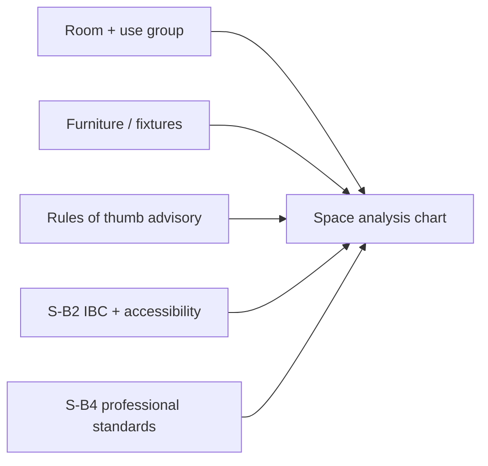

# Erganis Studio — Implementation Plan

> **Status:** **Ref** (hello-world) done; **S0** done; **S-I1** (inventory simple) in progress.  
> **Product plan:** [§7 Studio](../../../docs/erganis-product-plan.md#7-studio) · **Core deps:** [CORE-IMPLEMENTATION-PLAN](../../core/docs/temp/CORE-IMPLEMENTATION-PLAN.md) · **Index:** [IMPLEMENTATION-PLANS](../../../docs/IMPLEMENTATION-PLANS.md)

Studio ships as **per-module slices** — schema + handlers first (Nest modules loaded by Core), then Surface UI in `studio/apps/studio`. Complete Core **C3–C7** before the first real module ships end-to-end in the UI.

---

## Overview

| Phase | Module | Slice | Status | Core deps |
|-------|--------|-------|--------|-----------|
| **Ref** | Hello-world | — | Done | C2 |
| **S0** | Studio shell | 0 | Done (Refined Atelier draft) | C1, C16 |
| **S-D1** | Documents | 1 | Planned | C2, C6 |
| **S-D2** | Documents | 2 | Planned | C7, S0 |
| **S-D3** | Documents | 3 | Planned | S0 client, RBAC |
| **S-I1** | Inventory | 1 | In progress | C2, C7, S0 |
| **S-I2** | Inventory | 2 | Planned | C3 |
| **S-I3** | Inventory | 3 | Planned | Presentations S-Pr1 |
| **S-P1** | Planner | 1 | Planned | C2, C7 |
| **S-P2** | Planner | 2 | Planned | S-C1 |
| **S-C1** | Communications | 1 | Planned | C1, C9 |
| **S-Des1** | Design | 1 | Planned | C2, C7 |
| **S-Pr1** | Presentations | 1 | Planned | S-I1, S-Des1 |
| **S-B1** | Build | 1 | Planned | S-D1, C3 |
| **S-B2** | Build — Codes | 2 | Planned | S-B1, C2, C9 |
| **S-B3** | Build — Space analysis | 3 | Planned | S-B2, S-B4, S-I1 optional |
| **S-B4** | Build — Standards | 4 | Planned | S-B2, S-B1 |
| **S-Bus1** | Business | 1 | Planned | Reports S-R1 (later) |
| **S-R1** | Reports | 1 | Planned | Multiple modules |
| **S-N1** | Notes | 1 | Planned (docs only) | `erganis-notes` N0–N1 |
| **S-Ago1** | Agora (org) | 1 | Planned | Agora API, C2 |
| **S-3P** | Third-party | — | Planned | C4 |

---

## Ref — Hello-world stub

**Path:** `studio/modules/hello-world/`  
**Delivers:** Stub handler + envelope smoke proving Core loader path.

- Manifest: `erganis.module.json`
- Surface/action: `stub.save`
- Handler: `pingSave` → `hello_world.greetings`
- Build before Core: `npm install && npm run build`

---

## S0 — Studio web + desktop shell

**Status:** Done (web + Electron scaffold)

**Paths:**
- Web: `studio/apps/studio/` (`@erganis/studio-web`)
- Desktop: `studio/apps/desktop/` (`@erganis/studio-desktop`)
- Shared: `studio/shared/` (`@erganis/studio-shared`)

**Delivers:** Next.js shell wired to Core auth; Electron wraps the **same** UI for Mac and Windows.

| Layer | Stack | Commands |
|-------|-------|----------|
| **Web** | Next.js 14 + Tailwind | `npm run dev:web`, `npm run build:web` |
| **Desktop** | Electron 33 + electron-builder | `npm run dev:desktop`, `npm run package:desktop:mac`, `npm run package:desktop:win` |
| **Shared** | Core API client (session cookie) | `@erganis/studio-shared` |

| Item | Detail |
|------|--------|
| Auth | Session cookie flow to Core C1 (`credentials: 'include'` + CORS) |
| Desktop prod | Next `standalone` embedded; Electron spawns local server on `127.0.0.1` |
| Desktop dev | Concurrently runs Next dev + Electron → `http://localhost:3000` |
| UI | Tailwind **Refined Atelier** shell ([STUDIO-DESIGN.md](../docs/STUDIO-DESIGN.md)); **`erganis-ui`** / Shadcn at UI2 |
| Offline | Deferred — requires Core C11 sync + local replica |

See [`studio/README.md`](../README.md) and [`UI-ARCHITECTURE.md`](../../ui/docs/UI-ARCHITECTURE.md).

**Blocks:** All Surface UI slices (S-D2+, module dashboards).

---

## S-D1 — Documents (backend)

**Path:** `studio/modules/documents/`  
**Delivers:** `documents.*` schema + `migrations/`; upload metadata; vault list API; envelope `save` handler.

**Core deps:** C2 orchestrator, **C6 FileStore** for bytes.

---

## S-D2 — Documents (Surface UI)

**Delivers:** Project-linked attachments; Surface `documents` load; vault UI slot.

**Deps:** C7 Surface API, S0 shell.

---

## S-D3 — Documents (client portal)

**Delivers:** Client portal read-only vault view; trade-doc templates.

**Deps:** S0 client app (`apps/client`), RBAC.

---

## S-I1 — Inventory (CRUD)

**Path:** `studio/modules/inventory/`  
**Status:** In progress — backend + simple `/inventory` Surface UI

**Delivers:** Product/material CRUD; `inventory.*` schema; Surface `inventory` load/save; Studio catalog page (list + add form).

**Core deps:** C2 orchestrator, **C7 Surface load API**, S0 shell.

---

## S-I2 — Inventory (alternatives)

**Delivers:** Product alternatives; multi-step save with optional `post_commit`; `outcome: partial`.

**Core dep:** **C3** orchestrator hardening.

---

## S-I3 — Inventory (integrations)

**Delivers:** Shipment tracking hooks; Presentations composition blocks.

---

## S-P1 — Planner (Tasks / Kanban)

**Delivers:** Tasks (daily todo); Kanban board; envelope save.

---

## S-P2 — Planner (calendar)

**Delivers:** Calendar / scheduling; iCal consume from Communications.

---

## S-C1 — Communications

**Delivers:** Mailbox OAuth (separate from org SSO); thread list.

**Core deps:** C1 auth patterns, **C9** pg-boss jobs for sync.

---

## S-Des1 — Design v1

**Delivers:** Spaces, palettes, mood boards.

---

## S-Pr1 — Presentations

**Delivers:** Proposal builder; Inventory/Design composition blocks.

---

## S-B1 — Build (drawings & approvals)

**Path:** `studio/modules/build/`  
**Delivers:** Drawing vault refs; tags on drawing sets; approval envelope.

**Deps:** Documents S-D1, C3 entity locks.

- Drawing sets stored via Core FileStore (C6)
- Tags on plans/elevations — standalone or linked to Inventory `productPublicId`
- Drawing approval workflow — Core users & roles, orchestrator envelope

---

## S-B2 — Build — Codes (IBC & accessibility)

**Path:** `studio/modules/build/` (codes submodule)  
**Delivers:** Designer-facing **Codes** domain logic — building-code rules (IBC / accessibility) owned entirely by the Build module.

> **Codes are module logic, not a Core service.** Building-code rules are Build's domain. The Build module owns its own schema (`build.code_rule_packs`, `build.code_sync_log`), rule storage, query API, and any external code-service integration. Core provides only generic platform primitives (orchestrator, jobs, FileStore) — it has no knowledge of IBC.

### Layering (inside the Build module)

IBC and accessibility standards change by edition and jurisdiction. Build must not ship static code tables. Instead:

1. **Build codes layer** syncs and versions rule packs from an external code service / publisher API, run as a **module job contribution** (`contributions.jobs`) on Core's pg-boss runtime (C9)
2. **Build query layer** resolves applicable rules for the project's jurisdiction, occupancy group, and use type
3. **Build UI** surfaces code requirements as actionable guidance — not legal PDFs in a drawer

### Planned capabilities

| Area | Examples |
|------|----------|
| **IBC** | Occupancy classification, occupant load factors, egress width mins, plumbing fixture counts by occupancy |
| **Accessibility** | Clearances, reach ranges, turning space, door maneuvering — parallel rule family in same store |
| **Project context** | Building type, story count, sprinklered — filters which rule subsets apply |
| **Edition tracking** | Show active IBC edition; warn when project edition differs from latest synced pack |

### Surfaces

- `build.codes` load — applicable rule summary for current room/project
- Envelope save for designer overrides / notes and for triggering a rule-pack sync

**Core deps:** C2 orchestrator (envelope + module schema/migrations), **C9** pg-boss jobs for external sync. No Core codes service.

---

## S-B3 — Build — Space analysis & occupancy planner

**Delivers:** **Chart / analysis system** for rooms — help interior and architectural designers size spaces from program, furniture, circulation, and code — connecting IBC to everyday layout decisions.

### Analysis dimensions

| Dimension | Purpose |
|-----------|---------|
| **Room inventory** | What is in the room — furniture, fixtures, equipment (manual entry, Inventory link, or FF&E import) |
| **Footprint & clearance** | Per-item dimensions + required clearances; stack vs plan view summaries |
| **Occupant load** | User group / use type → occupant count via S-B2 IBC load factors |
| **Circulation** | Aisle width, door swing zones, path of travel — designer standards + code mins |
| **Rules of thumb** | General designer heuristics (conference seats/area, etc.) — **advisory**; may align with S-B4 Standards |
| **Code cross-check** | Compare against S-B2 Codes — pass / warn / fail |
| **Standards cross-check** | Compare against S-B4 (WELL/LEED criteria, firm standards) — pass / warn / fail |

### Chart system (concept)

Interactive room **analysis chart** — not just a static spreadsheet:

- **Program bar** — required area from occupancy × load factor
- **Furniture layer** — summed item footprints + clearances
- **Circulation layer** — remaining area vs recommended % of room
- **Code overlay** — IBC minimums from S-B2 (egress, accessibility clearance) highlighted on the chart
- **Scenario compare** — layout A vs B occupancy and clearance outcomes



### Designer outcomes

- Answer: *"Can this room hold 12 people with this furniture layout and meet egress?"*
- Bridge architectural IBC concepts (occupancy group, load factor) to interior layout (seating, clear paths)
- Export summary to Presentations or drawing set notes (later slice)

**Deps:** **S-B2** Codes, **S-B4** Standards (optional cross-check), optional **S-I1** Inventory for product dimensions.

**Failure classes:** Code violations → `required` warnings; standards → `required` or `advisory` by rule class; rules-of-thumb → `advisory` only.

---

## S-B4 — Build — Standards (professional & certification criteria)

**Path:** `studio/modules/build/` (standards submodule)  
**Delivers:** **Standards** domain logic — professional practice rules, firm standards, and **certification criteria** (WELL, LEED, ASID guidelines, etc.) applied on projects.

> **Distinct from Codes (S-B2) and Nomodeion (Lyceum).** **Codes** = binding regulatory (IBC/ADA). **Standards** = professional and certification criteria on live projects. **Nomodeion** = study/exam prep for those credentials — not project lookup.

### Layering (inside the Build module)

1. **Standards store** — `build.standards`, `build.standard_editions`, firm overrides; sync via module job where external bodies publish updates
2. **Query layer** — applicable standards for project type, certification target (WELL, LEED), firm policy
3. **Build UI** — checklist and guidance on drawing sets and space analysis (pairs with S-B3)

### Planned capabilities

| Area | Examples |
|------|----------|
| **WELL / LEED** | Credit/criteria checklist on project — not exam content (see Nomodeion) |
| **Firm standards** | FF&E clearance conventions, naming, submittal requirements |
| **Professional practice** | ASID-aligned practice notes; advisory overlays |
| **Edition tracking** | Active WELL/LEED version vs project registration |

### Surfaces

- `build.standards` load — applicable standards summary for project/room
- Envelope save for designer notes and standard-pack sync triggers

**Core deps:** C2, C9 (optional sync job). **Lyceum link:** Nomodeion L-N5 — “apply on project” from study paths.

---

## S-Bus1 — Business

**Delivers:** Budgeting skeleton; cost verification hooks.

---

## S-R1 — Reports

**Delivers:** Registered data emissions; cross-module dashboards.

---

## S-N1 — Notes

**Path:** `notes/modules/notes/` (repo **`erganis-notes`**, submodule `notes/`)  
**Architecture:** [`NOTES-ARCHITECTURE.md`](../../notes/docs/NOTES-ARCHITECTURE.md) · **Plan:** [`NOTES-IMPLEMENTATION-PLAN.md`](../../notes/docs/NOTES-IMPLEMENTATION-PLAN.md)

**Delivers (when implemented):** Constructable document kinds, annotations, dialogue, bibliography, connection-level ACL. Studio S-N1 wires Studio/Client UI; module logic lives in `erganis-notes`.

**Status:** Documentation + repo scaffold only — not implementation rush. Core **audit** (C9) and **search** cover platform concerns.

**Deps:** Core C2+; **Business (S-Bus1) requires Notes enabled.**

---

## S-Ago1 — Agora org module

**Path:** `agora/modules/` (owned by Agora repo, loaded by Core)  
**Delivers:** Org vendor list; trade account status; Core sync.

See [Agora implementation plan](../../agora/docs/AGORA-IMPLEMENTATION-PLAN.md).

---

## S-3P — Third-party modules

**Path:** `studio/modules/third-party/`  
**Rules:** Mandatory `migrations/`; own schema only; API-first. Enforced by Core **C4**.

---

## Studio layout

```
studio/
├── apps/studio/           # Designer application (web + desktop shell)
├── apps/client/           # Client portal (web)
├── modules/               # First-party plugins
├── modules/third-party/   # External modules
└── shared/                # App glue; re-exports @erganis/ui-*
```

**UI components:** [`erganis-ui`](../../ui/docs/UI-ARCHITECTURE.md) — not duplicated in `studio/shared/` long-term.

---

## Desktop + offline (follow-on)

| Capability | Core dep |
|------------|----------|
| Desktop shell (same build as web) | S0 |
| Local replica + offline read/write | C11 Sync API |
| Sync desktop ↔ Core | C11 |
| Conflict resolution UI | C3 locks + C11 |

Studio and Client share **Core PostgreSQL** via Surface API — same data model, different roles/layouts.

---

## External tools & export

High-priority patterns: Excel/CSV export (Inventory, Design FF&E), import validation, Pinterest/Instagram connect where APIs allow. Module owners declare export/import in manifest (TBD).

---

## Consumes from Core

- Surface API (`GET /surfaces/:id/load`)
- Operation envelope (`POST /operations/execute`)
- Auth (session cookie)
- FileStore (C6)
- Composition slots + theme (C10, C12)
- Generated TypeScript SDK from OpenAPI (C15)

## Consumes from erganis-ui

- `@erganis/ui-react` — headless hooks (`useSurfaceLoad`, `useTheme`, `useOperation`)
- `@erganis/ui-shadcn` — Shell, SlotOutlet, ThemeProvider, default components

See [`UI-ARCHITECTURE.md`](../../ui/docs/UI-ARCHITECTURE.md).

> **Codes (S-B2) and Standards (S-B4)** are Build module domain logic — not Core services.
